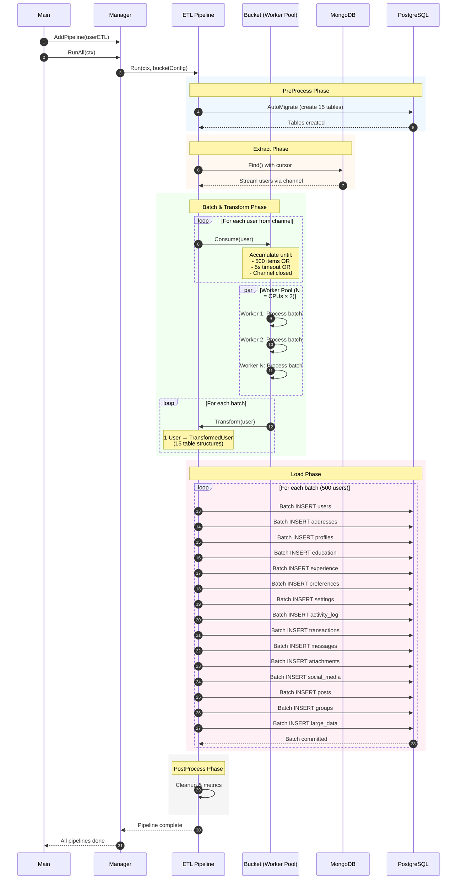
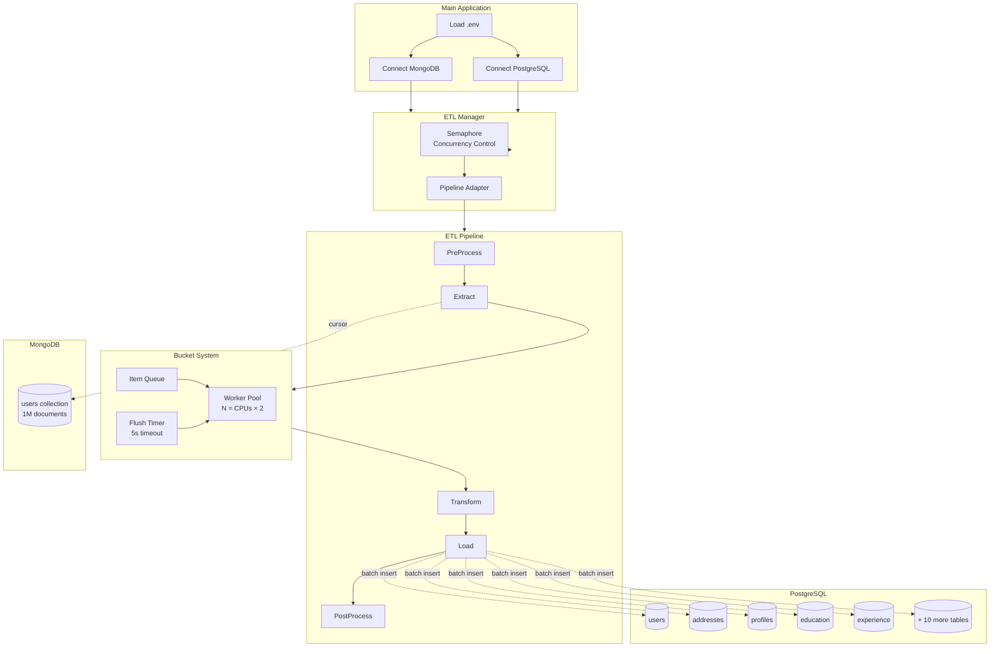

# Go ETL: MongoDB → PostgreSQL Migration Benchmark

High-performance ETL (Extract-Transform-Load) implementation in Go, benchmarked against Rust for MongoDB to PostgreSQL data migration.

## 🏆 Benchmark Results

**Dataset:** 1,000,000 users → 40,009,197 total records

| Language | Time | Users/sec | Records/sec | Memory |
|----------|------|-----------|-------------|--------|
| 🦀 **Rust** | **97.33s** | **10,276** | **411,031** | **~900 MB** |
| 🐹 **Go** | **132.08s** | **7,571** | **302,913** | **~1,100 MB** |
| **Winner** | **Rust -26%** | **Rust +36%** | **Rust +36%** | **Rust -22%** |

## 📚 Documentation

- **[BENCHMARK_SUMMARY.md](BENCHMARK_SUMMARY.md)** - Quick visual comparison
- **[FINAL_BENCHMARK_COMPARISON.md](FINAL_BENCHMARK_COMPARISON.md)** - Detailed analysis with recommendations
- **[WHY_RUST_IS_FASTER.md](WHY_RUST_IS_FASTER.md)** - Technical deep dive into performance differences
- **[PERFORMANCE_REPORT.md](PERFORMANCE_REPORT.md)** - Initial Go performance analysis

## 🚀 Quick Start

### Prerequisites

```bash
# Install dependencies
- Go 1.21+
- Docker (for MongoDB & PostgreSQL)
- Python 3 with pymongo (for dataset generation)
```

### Setup Databases

```bash
# Start MongoDB
docker run -d -p 27017:27017 --name mongodb mongo:latest

# Start PostgreSQL
docker run -d -p 5432:5432 \
  -e POSTGRES_PASSWORD=postgres \
  --name postgres postgres:18
```

### Generate Test Dataset

```bash
# Install Python dependencies
pip3 install pymongo

# Generate 1 million users (~40M total records)
cd /path/to/etl-rust/example
python3 generate_large_dataset.py
```

### Run Go Benchmark

```bash
# Clone and setup
git clone https://github.com/cuongtranba/go-etl.git
cd go-etl

# Configure environment
cp .env.example .env  # Edit with your database URLs

# Run benchmark
go run cmd/benchmark/*.go

# View profiles
go tool pprof -http=:8080 cpu.prof
go tool pprof -http=:8081 mem.prof
```

## 📁 Project Structure

```
go-etl/
├── cmd/
│   └── benchmark/          # Benchmark application
│       ├── main.go         # Entry point with metrics
│       ├── models_mongo.go # MongoDB document models
│       ├── models_postgres.go # PostgreSQL table models
│       └── pipeline.go     # ETL pipeline implementation
├── pkg/
│   ├── etl/               # ETL framework
│   │   ├── etl.go        # Core ETL interface
│   │   └── manager.go    # Pipeline orchestration
│   └── bucket/           # Batching system
│       └── bucket.go     # Batch processing logic
├── docs/                  # Design documents
├── .env                  # Database configuration
├── go.mod               # Go dependencies
└── README.md            # This file
```

## 🔧 Architecture

### ETL Framework

ETL framework implementation:

```go
type ETLProcessor[E, T any] interface {
    Extract(ctx context.Context) (<-chan Payload[E], error)
    Transform(ctx context.Context, e E) T
    Load(ctx context.Context, data []T) error
    PreProcess(ctx context.Context) error
    PostProcess(ctx context.Context) error
}
```

### Pipeline Configuration

```go
bucketConfig := &bucket.Config{
    BatchSize: 500,            // Records per batch
    WorkerNum: numCPUs * 2,    // Concurrent workers (32 on 16-core)
    Timeout:   5 * time.Second,
}

managerConfig := &etl.Config{
    WorkerNum: 1,              // Pipeline-level parallelism
}
```

### Data Flow

```
MongoDB Collection (1M users)
    ↓ Extract (cursor streaming)
    ↓ Bucket (batch into 500-record chunks)
    ↓ Transform (1 user → 15 table records)
    ↓ Load (batch insert to PostgreSQL)
    ↓ PostgreSQL (15 normalized tables, 40M records)
```

### Sequence Diagram



### Component Interaction



## 🗃️ Database Schema

### MongoDB → PostgreSQL Mapping

**1 MongoDB Document → 15 PostgreSQL Tables:**

1. `users` - Core user data
2. `addresses` - User addresses (1:1)
3. `profiles` - User profiles (1:1)
4. `education` - Education history (~3 per user)
5. `experience` - Work experience (~2.5 per user)
6. `preferences` - User preferences (1:1)
7. `settings` - User settings (~3 per user)
8. `activity_log` - Activity logs (~12 per user)
9. `transactions` - Financial transactions (~5 per user)
10. `messages` - User messages (~2.5 per user)
11. `attachments` - Message attachments (variable)
12. `social_media` - Social media data (1:1)
13. `posts` - Social media posts (~5 per user)
14. `groups` - Social media groups (~1.5 per user)
15. `large_data` - Large blob data (1:1)

## 📊 Performance Analysis

### Why Rust is Faster (26% advantage)

1. **No Garbage Collector** (10-15% gain)
   - Zero GC pauses
   - Deterministic memory management
   - Consistent performance

2. **Better Compiler Optimizations** (5-10% gain)
   - LLVM backend
   - SIMD vectorization
   - Aggressive inlining

3. **Efficient Memory Allocation** (3-5% gain)
   - More stack allocation
   - Less heap fragmentation
   - Lower overhead per allocation

4. **Database Driver Performance** (5-10% gain)
   - Binary protocol (sqlx)
   - Zero-copy deserialization
   - Less ORM overhead

5. **Async Runtime** (3-5% gain)
   - Zero-cost futures (Tokio)
   - Minimal per-task overhead
   - Better cache locality

**Read the full analysis:** [WHY_RUST_IS_FASTER.md](WHY_RUST_IS_FASTER.md)

### When to Choose Go

Despite being slower, Go is often the better choice:

- ✅ **Development Speed:** 10× faster to write and maintain
- ✅ **Team Scalability:** Easier to hire and onboard developers
- ✅ **Ecosystem:** Better cloud-native integration (Kubernetes, etc.)
- ✅ **Tooling:** Built-in testing, profiling, and benchmarking
- ✅ **Compilation:** 20-60× faster compile times

**Go makes sense for most projects** where the 26% performance difference doesn't justify the increased development complexity.

## 🎯 Recommendations

| Your Priority | Choose |
|---------------|--------|
| Maximum performance | 🦀 Rust |
| Cost optimization (huge scale) | 🦀 Rust |
| Predictable latency | 🦀 Rust |
| Development speed | 🐹 Go |
| Team productivity | 🐹 Go |
| Ecosystem integration | 🐹 Go |
| Most projects | 🐹 Go |

## 🔬 Reproducing the Benchmark

### Step-by-Step

```bash
# 1. Start databases
docker-compose up -d  # Or start containers individually

# 2. Generate 1M user dataset
cd etl-rust/example
python3 generate_large_dataset.py

# 3. Run Rust benchmark
cd etl-rust
cargo build --release
./target/release/example

# 4. Reset database
docker exec <postgres_container> psql -U postgres \
  -c "DROP DATABASE etl_example; CREATE DATABASE etl_example;"

# 5. Run Go benchmark
cd go-etl
go run cmd/benchmark/*.go

# 6. Compare results
cat go_benchmark_final.log | grep "Duration:"
cat rust_benchmark_output.log | grep "Duration:"
```

## 📈 Profiling

### CPU Profiling

```bash
# Go
go tool pprof -http=:8080 cpu.prof

# Rust (flamegraph)
open flamegraph.svg
```

### Memory Profiling

```bash
# Go
go tool pprof -http=:8081 mem.prof

# Rust (requires valgrind)
valgrind --tool=massif ./target/release/example
ms_print massif.out.*
```

## 🤝 Contributing

Contributions welcome! Areas of interest:

- [ ] Optimize Go implementation (use pgx instead of GORM)
- [ ] Add more ETL patterns (CDC, incremental loads)
- [ ] Benchmark with different dataset sizes
- [ ] Add more database targets (MySQL, ClickHouse)
- [ ] Implement streaming mode (no batching)
- [ ] Add data validation and error handling
- [ ] Benchmark with real-world data distributions

## 📝 License

MIT License - See LICENSE file for details

## 🙏 Acknowledgments

- **etl-rust** - Rust implementation baseline
- **Anthropic Claude** - AI pair programming assistance

## 📚 Further Reading

- [GORM Documentation](https://gorm.io/)
- [SeaORM Documentation](https://www.sea-ql.org/SeaORM/)
- [Tokio Async Runtime](https://tokio.rs/)
- [Go Concurrency Patterns](https://go.dev/blog/pipelines)
- [Rust Performance Book](https://nnethercote.github.io/perf-book/)

---

**Built with ❤️ for performance benchmarking**

**Star ⭐ this repo if you find it useful!**

## Repository Stats


